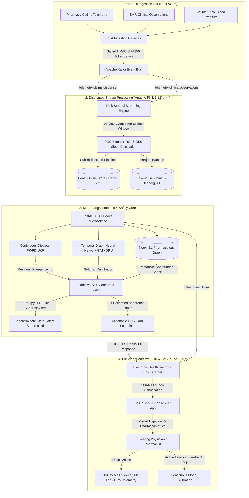

# 02. System Architecture & Data Flow

## 🏗️ High-Level System Architecture Diagram

AuraMed is engineered as an enterprise-grade, distributed clinical intelligence platform combining systems programming (Rust), stream processing (Apache Flink), real-time feature storage (Feast/Redis), state-space pharmacometrics (UKF/PyTorch), graph reasoning (Neo4j), and HL7 standard clinical interfaces (CDS Hooks 1.0 & SMART-on-FHIR).



---

## 🔬 Layer-by-Layer Technical Specifications

### Layer 1: Zero-PHI Ingestion Gateway (Rust / Axum)
- **Directory:** `auramed/ingestion-gateway`
- **Language & Framework:** Rust 1.76+ with `axum`, `tokio`, and `rdkafka`.
- **Functionality:**
  - Serves high-throughput edge REST ingestion endpoints (`POST /api/v1/telemetry/dispense`, `POST /api/v1/telemetry/observations`).
  - **Zero-PHI Compliance:** Strips all Direct Patient Identifiers (Names, MRNs, SSNs, DOBs).
  - Computes a cryptographically deterministic **Salted HMAC-SHA256 Token** using a 256-bit Healthcare KMS Master Secret + tenant salt:
    $$\text{Token} = \text{HMAC-SHA256}(K_{\text{master}}, \text{Salt} \parallel \text{RawPatientID})$$
  - Dispatches de-identified payloads to partitioned Apache Kafka topics with sub-millisecond overhead.

### Layer 2: Real-Time Stream Analytics (Apache Flink 1.18 in Java)
- **Directory:** `auramed/streaming-job`
- **Language & Framework:** Java 17, Apache Flink 1.18, Flink Kafka Connector.
- **Functionality:**
  - Consumes partitioned streams: `telemetry.claims.dispense`, `telemetry.clinical.observations`, `telemetry.clinical.encounters`.
  - **Stateful Sliding Window:** Maintains an exact 90-day event-time sliding window per patient token.
  - **Bitmask PDC Computation:** Implements a compact 90-bit bitmask tracking daily medication coverage:
    $$\text{PDC}_{90\text{d}} = \frac{\sum_{i=1}^{90} \text{Bit}_i}{90}$$
  - **Refill Gap Index (RGI):** Measures gap frequency and spacing:
    $$\text{RGI} = \frac{\text{Total Uncovered Days Between Fills}}{\text{Observation Window (90)}}$$
  - **Pickup Interval Variance:** Evaluates regularity and temporal jitter in pharmacy pickup dates.
  - **OLS Biomarker Trend:** Computes ordinary least squares regression slope ($d\text{SBP}/dt$ or $d\text{HbA1c}/dt$) over longitudinal lab measurements.
  - Sinks real-time features into Redis in under 2ms.

### Layer 3: Feature Store Tier (Feast + Redis + MinIO/Iceberg)
- **Directory:** `auramed/feature-store`
- **Technologies:** Feast 0.36+, Redis 7.2 (Alpine), MinIO S3 / Apache Iceberg.
- **Schema & Latency:**
  - **Online Store (Redis):** Keyed by `auramed:patient:{token}`. Serves feature vectors (PDC, RGI, covered days, variance, slopes) to the CDS Hooks engine with $<1\text{ ms}$ retrieval latency.
  - **Offline Lakehouse (MinIO / Iceberg):** Stores historical Parquet telemetry for model training, longitudinal cohort analysis, and split-conformal calibration sets.

### Layer 4: Machine Learning, Pharmacometrics & Safety Core
- **Directory:** `auramed/ml-core`
- **Language & Framework:** Python 3.10+, PyTorch 2.2+, NumPy, SciPy.
- **Architectural Components:**

#### 1. Continuous-Discrete PK/PD Unscented Kalman Filter (`pkpd_ukf.py`)
- Models the latent oral absorption and systemic disposition of drugs using nonlinear ordinary differential equations:
  $$\frac{dA_{\text{gut}}}{dt} = -k_a A_{\text{gut}}$$
  $$\frac{dC_{\text{plasma}}}{dt} = \frac{k_a \cdot F \cdot A_{\text{gut}}}{V_d} - \left(\frac{CL}{V_d}\right) C_{\text{plasma}}$$
- Models biomarker turnover pharmacodynamics using a sigmoidal $E_{max}$ Hill equation:
  $$\frac{dE}{dt} = k_{\text{out}} \left[ E_0 \cdot \left(1 - \frac{E_{max} \cdot C^\gamma}{EC_{50}^\gamma + C^\gamma}\right) - E \right]$$
- Employs the **Scaled Unscented Transform** ($\alpha=1.0, \beta=2.0, \kappa=0.0$) across $2n+1$ sigma points to propagate mean and covariance without linearizing nonlinear kinetics.
- Computes the **Mahalanobis Residual Divergence $r(t)$**:
  $$r(t) = \sqrt{(y_{\text{obs}} - \hat{y}(t))^T S(t)^{-1} (y_{\text{obs}} - \hat{y}(t))}$$
  Where $S(t) = H P(t) H^T + R$ is the innovation covariance.

#### 2. Temporal Graph Neural Network (`tgnn_adherence.py`)
- **Structure Layer:** Multi-Head Graph Attention Network (GAT) with edge features modeling interactions between prescribed medications, chronic conditions, and metabolic enzymes.
- **Temporal Layer:** 2-layer Gated Recurrent Unit (GRU) consuming longitudinal telemetry (PDC, RGI, interval variance, biomarker values, encounter frequencies).
- **Classification Output:** Softmax probability distribution over three latent adherence states:
  $$P(\text{Adherence}) = [\text{Concordant}, \text{Intermittent}, \text{Abandoned}]$$

#### 3. Inductive Split-Conformal Prediction Gate (`conformal_gate.py`)
- Evaluates non-conformity scores on holdout validation data:
  $$s_i = 1 - P(Y = y_i \mid X_i)$$
- Determines the finite-sample calibrated quantile cutoff $\hat{q}$:
  $$\hat{q} = \text{Quantile}\left( \{s_i\}_{i=1}^n, \frac{\lceil(n+1)(1-\alpha)\rceil}{n} \right)$$
- Builds conformal prediction sets:
  $$C(X_{n+1}) = \{ y \in \mathcal{Y} \mid 1 - P(Y = y \mid X_{n+1}) \le \hat{q} \}$$
- **Mathematical Safety Guarantee:** Enforces $P(Y_{n+1} \in C(X_{n+1})) \ge 1 - \alpha = 90\%$ coverage.
- **Epistemic Entropy Cutoff:** Computes normalized Shannon entropy $H(P)$:
  $$H(P) = -\sum_{k=1}^K P_k \log_K(P_k)$$
  If $|C(X)| > 1$ **OR** $H(P) > 0.10$, the engine marks the result as `INDETERMINATE` and **suppresses the alert**, eliminating false accusations and alert fatigue.

### Layer 5: Pharmacology Knowledge Graph (Neo4j 5.x)
- **Directory:** `auramed/knowledge-graph`
- **Database & Driver:** Neo4j 5.18 Community with APOC, `neo4j-python-driver` (Async).
- **Schema & Ontologies:**
  - Nodes: `Medication` (RxNorm), `Enzyme` (CYP2D6, CYP3A4, CYP2C19, OCT1/2), `Phenotype` (Poor, Intermediate, Normal, Ultra-rapid Metabolizer), `LabBiomarker` (LOINC).
  - Relationships: `METABOLIZED_BY`, `INHIBITS`, `INDUCES`, `MODULATES_LAB`.
- **Clinical Confounder Traversal:**
  - Runs parameterized Cypher queries to verify if biomarker non-response is due to enzymatic competition, competitive inhibition, or drug-drug interaction (e.g., Amiodarone inhibiting Metformin renal clearance or Fluoxetine inhibiting Lisinopril activation).

### Layer 6: HL7 CDS Hooks 1.0 Microservice (FastAPI)
- **Directory:** `auramed/cds-hooks-service`
- **Language & Framework:** Python 3.10+, FastAPI, Pydantic v2, Uvicorn.
- **Specification:** HL7 CDS Hooks 1.0 compliant.
- **Endpoints:**
  - `GET /cds-services`: Discovery endpoint advertising supported hooks (`patient-view`, `medication-prescribe`).
  - `POST /cds-services/auramed-patient-view`: Triggered upon opening a patient's chart in an EMR.
  - `POST /cds-services/auramed-medication-prescribe`: Triggered when ordering new medications.
- **Output:** Returns non-punitive CDS Cards equipped with 1-click FHIR `ServiceRequest` orders (CMP LOINC 24323-8, Home BP Telemetry LOINC 85354-9) and SMART Launch links.

### Layer 7: SMART-on-FHIR Clinician Dashboard UI (React + TypeScript)
- **Directory:** `auramed/smart-on-fhir-app`
- **Language & Stack:** React 18, TypeScript, Vite, Tailwind CSS, Lucide React, Canvas API.
- **Design Philosophy:** Hospital-grade White Theme (default) with clean slate borders, with dark mode toggle.
- **Key Modules:**
  - `BiomarkerTrajectoryChart.tsx`: Plots observed lab points against counterfactual PK/PD trajectory and $\pm 2\sigma$ uncertainty envelope.
  - `RefillTimeline.tsx`: Interactive 90-day CMS PDC bitmask visualizer with color-coded dispensing events.
  - `ClinicalActionPanel.tsx`: 1-Click action triggers (Switch to 90-day mail delivery, order labs, dispatch outreach).
  - `ClinicRosterView.tsx`: Cohort triage table prioritizing patients by divergence sigma and risk index.
  - Modals: Neo4j Pharmacology Graph Explorer, SBAR Consultation Note Export, Patient SMS Assistant, and Clinician Audit Feedback.

### Layer 8: Production Cloud & Kubernetes Infrastructure
- **Directories:** `auramed/helm` & `auramed/terraform`
- **Components:**
  - **AWS Terraform:** Automated provisioning of multi-AZ VPC, AWS EKS (Kubernetes 1.29), AWS KMS (256-bit envelope encryption), Amazon ElastiCache for Redis, and Aurora PostgreSQL.
  - **Helm Charts (`auramed-core`):** Production Kubernetes deployments with Horizontal Pod Autoscalers (HPA), rolling update strategies, and PodDisruptionBudgets.

---

## 🔄 End-to-End Data Flow Lifecycle

Here is the exact step-by-step lifecycle of an event moving through AuraMed:

```
[Retail Pharmacy Dispense / Cellular BP Reading]
                   │
                   ▼ (Step 1)
   Rust Ingestion Gateway (Port 8080)
   • Strips Direct PHI (Name, SSN, MRN)
   • Encrypts Patient ID -> HMAC-SHA256 Token
                   │
                   ▼ (Step 2)
   Apache Kafka Broker (Port 9092)
   • Partitioned topic: telemetry.claims.dispense
                   │
                   ▼ (Step 3)
   Apache Flink Streaming Engine (Port 8081)
   • Recovers 90-day event-time window
   • Updates 90-bit PDC bitmask & refill gap variance
                   │
                   ▼ (Step 4)
   Feast Redis Online Feature Store (Port 6379)
   • Stored in hash 'auramed:patient:{token}' (<1ms access)
                   │
                   ▼ (Step 5)
   Clinician Opens Patient Chart in EHR (Epic / Cerner)
   • EHR fires 'patient-view' hook to FastAPI (Port 8000)
                   │
                   ▼ (Step 6)
   AuraMed Safety & Pharmacometrics Engine
   • Fetches features from Redis
   • Runs PK/PD UKF: calculates Mahalanobis divergence r(t)
   • Traverses Neo4j: checks for CYP450 confounders
   • Passes through Split-Conformal Gate: H(P) <= 0.10 check
                   │
                   ▼ (Step 7)
   EHR Displays Non-Punitive CDS Card
   • Summary: "Therapeutic Discordance Observed"
   • Clinician clicks "View Pharmacometrics Trajectory"
                   │
                   ▼ (Step 8)
   SMART-on-FHIR Dashboard (Port 5173)
   • Visualizes trajectory, refill bitmask, and graph
   • Clinician clicks "Switch to 90-Day Mail Order"
   • Order written back to EHR via FHIR ServiceRequest
```
